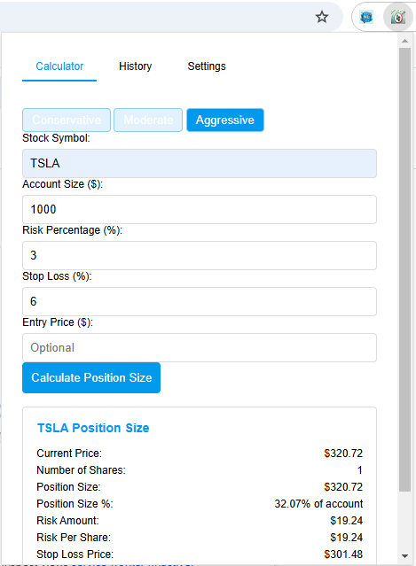

# Position Size Calculator Chrome Extension

## Overview
The Position Size Calculator Chrome Extension helps traders calculate optimal position sizes for their stock trades based on risk management principles. It fetches the current stock price from the Alpha Vantage API and performs calculations based on user inputs.

## Features
- Calculate position size based on risk percentage and stop loss.
- Save default risk and stop loss settings.
- View and edit calculation history.
- Use preset risk and stop loss configurations.
- Fetch real-time stock prices.

## Installation
1. **Clone this repository**:
   ```bash
   git clone https://github.com/yourusername/position-size-calculator.git
   ```
2. **Load the extension in Chrome**:
   - Open Chrome and go to `chrome://extensions/`.
   - Enable "Developer mode" in the top right corner.
   - Click "Load unpacked" and select the cloned repository directory.

## Usage
1. **Input your trade details**:
   - Enter the stock symbol, account size, risk percentage, stop loss, and optional entry price.
2. **Calculate**:
   - Click the "Calculate Position Size" button to get the position size, risk amount, and other details.
3. **View History**:
   - Switch to the "History" tab to see past calculations.
4. **Manage Settings**:
   - Set default risk and stop loss percentages in the "Settings" tab.

### Example of Position Sizing Calculation



